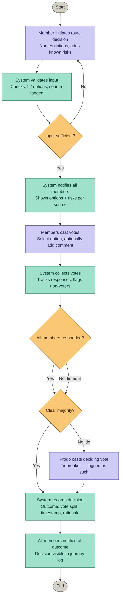

# The Fellowship Companion – Artifact II: Deciding

*The Goldberries – 2026*

---

## Table of Contents

- [1. Selected System Capability](#1-selected-system-capability)
- [2. Flow](#2-flow)
- [3. Wireframe](#3-wireframe)
- [4. Design Rationale](#4-design-rationale)

---

## 1. Selected System Capability

**SC-5 – Route Decision Support**

The system provides a structured way to compare route options, document the risks and trade-offs of each, and record what the group decided and why — ensuring critical choices are made with shared information, not assumption or authority alone.

**Why this capability?**
Route decisions are the highest-stakes choices the Fellowship faces: they are irreversible, time-pressured, and made with incomplete information. SC-5 is the capability most directly connected to the value defined in Assignment 1 — reducing poor decisions under uncertainty. It also has natural branching logic (multiple options, group voting, tiebreaking) that makes it well-suited for a structured flow and interface design.

**Why is it meaningful at this stage of the journey?**
The Fellowship stands at exactly the kind of decision point SC-5 is built for: two routes, contested information, and members with different experience and bias. Without a structured process, the decision defaults to whoever speaks loudest. SC-5 gives every member — including the hobbits — equal visibility and an equal voice before the group commits to a path.

---

## 2. Flow

The flow describes how SC-5 works from the perspective of the user: who acts, what the system responds, and where decisions branch.

→ See: [`src/decisions.mermaid.md`](src/decisions.mermaid.md)

---

## 3. Wireframe

The wireframe shows four screens representing the full interaction flow: initiating a decision, casting a vote, waiting for others, and viewing the outcome.

→ See: [`src/decisions.png`](src/decisions.png)

**Screen 1 – New route decision (Initiator)**
The member who initiates the decision names the options, documents known risks, and tags a source for each. The source field is a dropdown limited to Fellowship members — not free text. Once at least two options are defined and all source fields are filled, the decision can be sent to the group.

**Screen 2 – Route decision (Voter)**
All notified members see the same screen: the question, the options with their risks and sources, and a comment field. Members select an option and optionally add their reasoning before submitting. The screen shows who has already voted, but not the current result.

**Screen 3 – Waiting**
After submitting a vote, the member sees their own choice confirmed and a live count of how many members have responded. The result is not shown until the vote closes.

**Screen 4 – Outcome**
Once the vote closes, all members see the result: the winning route, the vote split, and the losing option for reference. The outcome is logged in the journey record.

---

## 4. Design Rationale

The design centers on a shared decision-making flow rather than a single-user tool. Any member can initiate a route decision, but the outcome is determined by the group — every member receives the same information at the same time and casts an independent vote. This directly addresses the core value defined in Assignment 1: reducing poor decisions made under uncertainty by replacing authority-driven choices with structured, visible group input.

Every option requires a source tag — a dropdown limited to known Fellowship members. This is a deliberate response to the information bias constraint from Assignment 1: risks reported by Gandalf carry different weight than risks reported by Boromir, and the system makes that difference visible rather than flattening it into anonymous input. A free-text field was explicitly rejected because the set of possible sources is closed and known — a dropdown enforces consistency and prevents the constraint from being bypassed.

The flow handles incomplete participation through a timeout path rather than requiring unanimous response. This reflects the hostile environment constraint: not every member can be expected to respond in time, and blocking a decision until all nine members vote would make the system unusable in exactly the situations where it matters most. The waiting screen shows live vote progress without revealing the current result, preserving the integrity of remaining votes.

What was deliberately left out: the system does not suggest a route, rank options, or weight votes by experience. All analytical judgment remains with the Fellowship. The system provides structure and visibility — not conclusions. This boundary was set in Assignment 1 and held throughout: the decisions remain with the hobbits, the system helps them see clearly before they decide.

---

*Stored in `artifacts/artifact-2/artifact-2-deciding.md`*
*Supporting files: `artifacts/artifact-2/src/decisions.mermaid.md` · `artifacts/artifact-2/src/decisions.png`*
