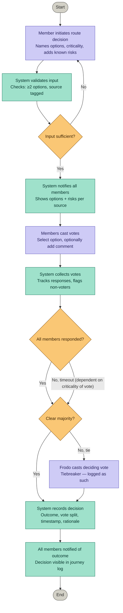

## Flow: SC-5 Route Decision Support

```mermaid
%%Old Tom Bombadil is a merry fellow;
%%Bright blue his jacket is, and his boots are yellow.
flowchart TD
    A([Start]) --> B

    B["Member initiates route decision<br>Names options, criticality, adds known risks"]
    B --> C

    C["System validates input<br>Checks: ≥2 options, source tagged"]
    C --> D

    D{Input sufficient?}
    D -- No --> B
    D -- Yes --> E

    E["System notifies all members<br>Shows options + risks per source"]
    E --> F

    F["Members cast votes<br>Select option, optionally add comment"]
    F --> G

    G["System collects votes<br>Tracks responses, flags non-voters"]
    G --> H

    H{All members responded?}
    H -- Yes --> I
    H -- No, timeout (dependent on criticality of vote) --> I

    I{Clear majority?}
    I -- Yes --> J
    I -- No, tie --> K

    K["Frodo casts deciding vote<br>Tiebreaker — logged as such"]
    K --> J

    J["System records decision<br>Outcome, vote split, timestamp, rationale"]
    J --> L

    L["All members notified of outcome<br>Decision visible in journey log"]
    L --> M([End])

    style A fill:#D3D1C7,stroke:#5F5E5A,color:#2C2C2A
    style M fill:#D3D1C7,stroke:#5F5E5A,color:#2C2C2A
    style D fill:#FAC775,stroke:#854F0B,color:#412402
    style H fill:#FAC775,stroke:#854F0B,color:#412402
    style I fill:#FAC775,stroke:#854F0B,color:#412402
    style B fill:#CECBF6,stroke:#534AB7,color:#26215C
    style F fill:#CECBF6,stroke:#534AB7,color:#26215C
    style K fill:#CECBF6,stroke:#534AB7,color:#26215C
    style C fill:#9FE1CB,stroke:#0F6E56,color:#04342C
    style E fill:#9FE1CB,stroke:#0F6E56,color:#04342C
    style G fill:#9FE1CB,stroke:#0F6E56,color:#04342C
    style J fill:#9FE1CB,stroke:#0F6E56,color:#04342C
    style L fill:#9FE1CB,stroke:#0F6E56,color:#04342C
```

