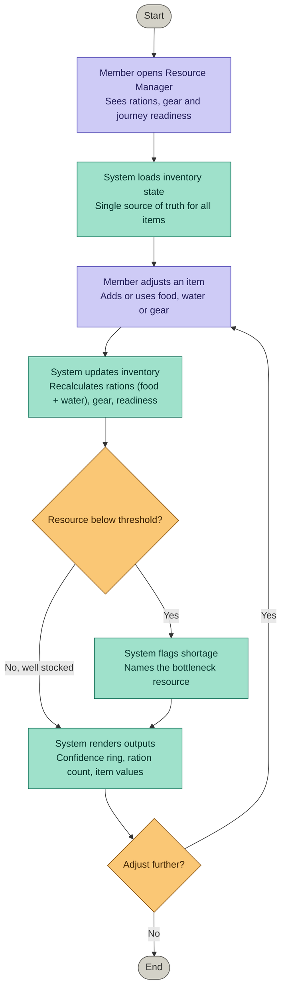
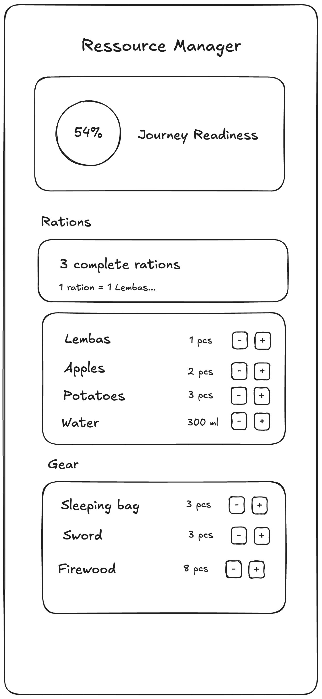

# Artifact 5 — System Integration & Extension

## 1. Selected System Capability

We selected **SC-1 – Inventory & Resource Tracking** from our original
Assignment 1 capability list.

SC-1 lets the group record and monitor their supplies — food, water, and gear —
and makes low levels visible before they become critical. We chose it because it
sits at the opposite end of the same journey SC-5 already supports: where SC-5
(Route Decision Support) decides *where* the Fellowship goes, SC-1 answers whether
they are actually equipped to get there. The two capabilities frame the same
journey from two sides — intent and capacity.

**Extension — Chart.js (library), not an API.** We deliberately chose a library
over an external API call. We looked for an API that would extend SC-1 both
cleanly and meaningfully — weather influencing consumption was our strongest
candidate, echoing Caradhras in SC-5 — but every option either introduced a *new*
capability instead of deepening SC-1, or added network and error-handling
complexity out of proportion to the value it returned. Chart.js instead changes
how the resource state is *read*: the journey-readiness ring and the live bars
turn a set of raw counts into an at-a-glance judgement of preparedness. That is
exactly the "make low levels visible before they become critical" intent of SC-1 —
the extension deepens the capability rather than bolting a new one onto it.

## 2. Mermaid Flow Diagram

The flow centres on the inventory state as the single source of truth: a member
adjusts food, water, or gear, and the system recalculates the derived values —
complete rations and overall journey readiness. A single decision point checks
whether any resource has fallen below its threshold, flags the bottleneck, and
re-renders the outputs before returning to the adjustment step.

## 3. Wireframe

## 4. Implementation files

- [resource-manager.js](src/resource-manager.js)
- [interface.html](src/interface.html)
- [style.css](src/style.css)

## 5. Design Rationale

**How the integrated system still reflects the original intent and value.**

SC-1 was defined in Phase 1 to let the group understand what they still have and
what they are running out of, and to make low levels visible *before* they become
critical. The implementation holds to that intent literally: every screen element
answers one of those two questions. The item lists show what the group has; the
journey-readiness ring and the ration count show whether that is enough; and the
threshold check surfaces a shortage by name before it turns into a crisis. Nothing
on the screen is decorative — each part maps back to the original purpose.

**How individual slices connect meaningfully.**

The screen reads top to bottom as a chain of inference, not a set of unrelated
widgets. Raw item counts (bottom) feed the ration calculation (middle), which
feeds the journey-readiness figure (top). A change to any single item — using one
apple, adding firewood — propagates upward through the same inventory state and is
reflected in all three layers at once. This is the same single-source-of-truth
pattern we used for SC-5's voting state, applied here to inventory: one piece of
data, many derived views, always consistent. The wireframe places the *derived*
judgement (readiness) first and the *raw* inputs last on purpose — the user sees
the conclusion, then the evidence behind it.

**Why the chosen extension makes sense.**

We extended SC-1 with Chart.js (a library) rather than an external API. We searched
for an API that would deepen SC-1 cleanly — weather affecting consumption was our
strongest idea, echoing Caradhras from SC-5 — but each candidate either introduced
a new capability instead of strengthening this one, or carried network and
error-handling cost out of proportion to its value. Chart.js instead works on data
the system already owns: the readiness ring turns a calculated percentage into an
at-a-glance judgement, and the resource bars make criticality legible rather than
buried in numbers. The extension changes how the state is *read* and acted on —
which is exactly the "make low levels visible before they become critical" promise
of SC-1 — so it deepens the capability instead of bolting a new one beside it.

**What we intentionally did not build.**

We deliberately left out a per-user model. SC-5 is built around user selection —
members vote, Frodo breaks ties — but we did not carry that over to SC-1. A single
shared inventory removed an entire layer of complexity (per-user state, sync,
conflict resolution) that would not have earned its keep here, and it is also
narratively honest: early in the journey the Fellowship travels as one party, and
it is realistic that one member — Sam, in practice — owns the provisions. We also
did not build persistence or a backend. We know this model breaks down once the
Fellowship splits into separate groups travelling apart, each needing its own
resource state kept in sync — but that requires a functional backend well beyond
this assignment's scope. We chose to make the early-journey assumption explicit
rather than build speculative machinery for a stage the course does not ask us to
reach.

*Clarity over completeness. Structure over cleverness.*

## 6. Reflection on System Evolution

When we defined SC-1 in Phase 1, we pictured a fairly literal inventory: a list of
items with quantities and a flag when something ran low. Building it at the end of
the iteration changed our understanding in three ways.

**From itemised tracking to derived readiness.**

Our Phase 1 view treated each resource as a separate number to watch. Implementing
it, we realised the group doesn't actually care about "8 apples" — they care about
whether the food, water and lembas together add up to enough *rations* to keep
going. So the system now derives meaning from the raw counts: food and water
combine into complete rations (limited by the scarcest ingredient), and rations
plus gear roll up into a single journey-readiness figure. The numbers became inputs
to a judgement rather than the judgement itself.

**A single resource manager, on purpose.**

SC-5 was built around user selection — members vote, Frodo breaks ties. For SC-1 we
deliberately did not carry that model over. A shared, single inventory removed a
whole layer of complexity (per-user state, conflict resolution) that would not have
paid for itself here. It is also narratively honest: early in the journey the
Fellowship travels as one group, and it is realistic that one member — Sam, in
practice — takes ownership of the provisions. The simplification is a design
decision, not a shortcut.

**Where we stopped, and why.**

We know this model breaks down later in the journey. Once the Fellowship splits into
separate groups travelling apart, a single shared inventory no longer reflects
reality — each group would need its own resource state, and keeping those in sync
would require a functional backend and persistence. That is well beyond the scope of
this assignment, so we chose to make the early-journey assumption explicit rather
than build speculative machinery for a stage the course does not ask us to reach.

The throughline across all three: extending a system does not have to mean reaching
outside it. The most honest extension we found was the one that made our existing
data more legible, not the one that added the most surface area.
