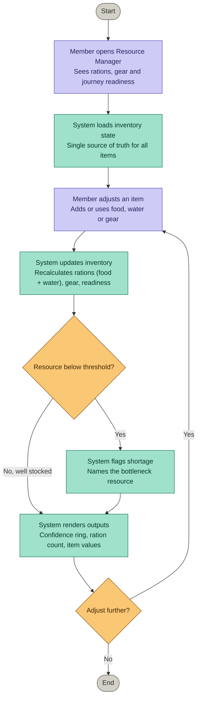

```mermaid
%% SC-1 Inventory & Resource Tracking
%% A full pack is a brave heart; an empty one, a long road.
flowchart TD
A([Start]) --> B
B["Member opens Resource Manager<br>Sees rations, gear and journey readiness"]
B --> C
C["System loads inventory state<br>Single source of truth for all items"]
C --> D
D["Member adjusts an item<br>Adds or uses food, water or gear"]
D --> E
E["System updates inventory<br>Recalculates rations (food + water), gear, readiness"]
E --> F
F{Resource below threshold?}
F -- Yes --> G
F -- No, well stocked --> H
G["System flags shortage<br>Names the bottleneck resource"]
G --> H
H["System renders outputs<br>Confidence ring, ration count, item values"]
H --> I
I{Adjust further?}
I -- Yes --> D
I -- No --> J
J([End])
style A fill:#D3D1C7,stroke:#5F5E5A,color:#2C2C2A
style J fill:#D3D1C7,stroke:#5F5E5A,color:#2C2C2A
style F fill:#FAC775,stroke:#854F0B,color:#412402
style I fill:#FAC775,stroke:#854F0B,color:#412402
style B fill:#CECBF6,stroke:#534AB7,color:#26215C
style D fill:#CECBF6,stroke:#534AB7,color:#26215C
style C fill:#9FE1CB,stroke:#0F6E56,color:#04342C
style E fill:#9FE1CB,stroke:#0F6E56,color:#04342C
style G fill:#9FE1CB,stroke:#0F6E56,color:#04342C
style H fill:#9FE1CB,stroke:#0F6E56,color:#04342C
```
