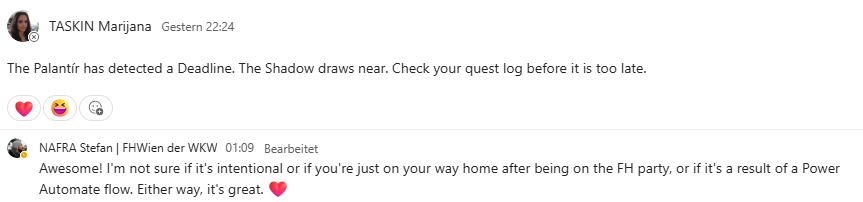

# Re-Extending the Fellowship

A short overview of our automation and our low-code app for this task.

## Automation: Power Automate – "The Fellowship Acts on Its Own"

We built a small flow on the Microsoft Power Automate platform.

**What it does:** when a new email arrives in Office 365 Outlook, the flow checks whether the email is deadline-related. If it is, the flow automatically posts a themed notification message into a Microsoft Teams channel — so the team gets a heads-up without anyone having to check their inbox.

**Trigger condition:** the flow fires when the subject or body of the incoming email contains the word "Deadline".

**Action / parameters:** the flow then posts a message as a user to the "Communication" channel of the "28Application – Nafra" team in Microsoft Teams, with a custom, Lord-of-the-Rings-themed message:

> "The Palantír has detected a Deadline. The Shadow draws near. Check your quest log before it is too late."

**Result in Teams:** the message is posted automatically and visible to the whole channel, prompting a (very on-brand) reaction from the team.

## Low-Code App: "Orc Jump" (Microsoft MakeCode Arcade)

For our low-code app, we built our own jump-and-run game using Microsoft MakeCode Arcade.

**Gameplay:** the player controls a hobbit who runs automatically and constantly moves forward. The only active control is jumping to avoid obstacles. Orcs spawn at random intervals and move toward the player at random speeds; occasionally two orcs spawn at once, briefly raising the difficulty. Touching an orc ends the game. Lembas bread also spawns at random heights and intervals — collecting it increases the score (with a sound and a small "eaten" animation) and encourages riskier jumps. Lembas disappears automatically once collected or once it leaves the screen.

**Concepts implemented:**
- Sprite creation and animation
- Tilemap as the game world
- Gravity and jump mechanics via acceleration and velocity
- Event-driven programming (button input, collisions)
- Random spawning of enemies and collectibles
- Score system and high-score tracking
- Game-over logic on collision with obstacles

**Link:** https://arcade.makecode.com/S17923-21189-10164-90866
